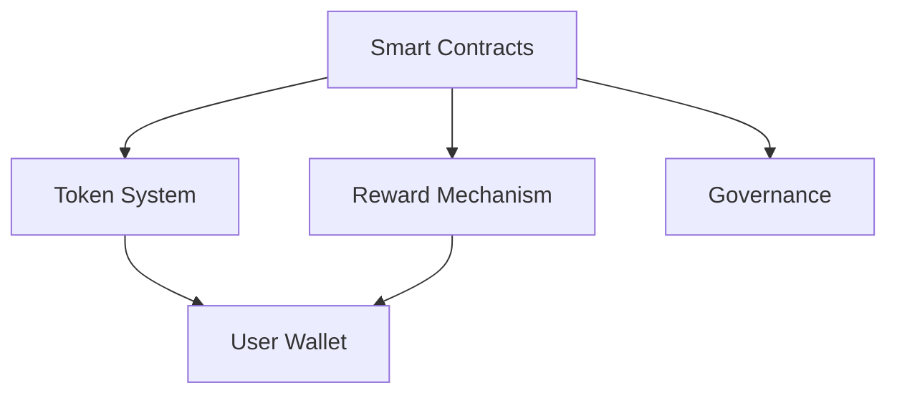

# File: technical/architecture.md
# System Architecture

## Overview
The Knot Riddles platform is built on a modern, scalable architecture that combines blockchain technology with advanced AI systems.

## Core Components

### 1. Blockchain Layer


### 2. AI System Layer
```python
class KnotRiddleSystem:
    def __init__(self):
        self.riddle_generator = RiddleGenerator()
        self.reward_calculator = RewardCalculator()
        self.security_validator = SecurityValidator()
        
    async def process_interaction(self, user_input):
        validated_input = await self.security_validator.check(user_input)
        response = await self.riddle_generator.generate(validated_input)
        rewards = await self.reward_calculator.compute(response)
        return ProcessedResponse(response, rewards)
```

### 3. Frontend Architecture
- React.js components
- Web3 integration
- State management
- UI/UX optimization

## System Interactions

### 1. Data Flow
- User input processing
- Blockchain transactions
- AI model interactions
- Response generation

### 2. Security Layer
- Input validation
- Transaction verification
- Anti-bot measures
- Exploit prevention
